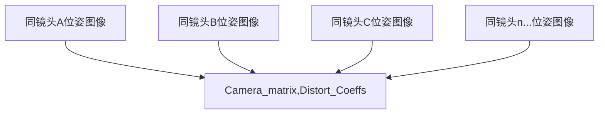
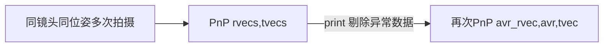
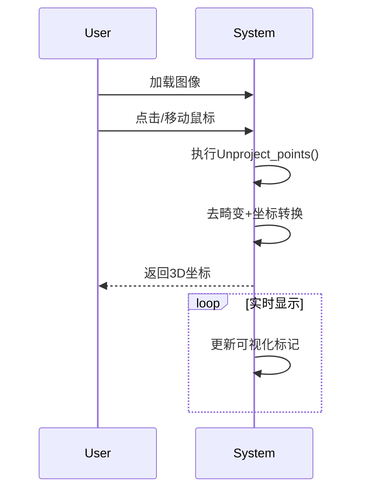
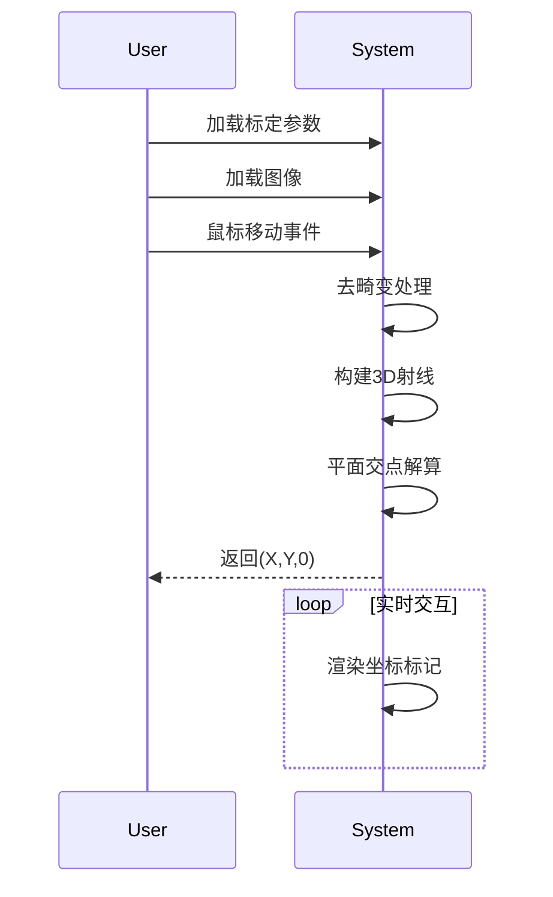

# 视觉坐标测量算法技术说明
### 版本说明：v1.0
### 2025.8.15
### 
## 1. 标定子系统

### 1.1 相机内参标定
- 标定板精度要求：±0.01mm/m
- 张正友标定法改进流程
- 畸变模型选择依据（Brown-Conrady模型）
- 
```python
# 相机标定
ret, camera_matrix, dist_coeffs, rvecs, tvecs = cv2.calibrateCamera(
    world_points, image_points, gray.shape[::-1], None, None
)
```




### 1.2 相机外参标定
- 使用PnP求解相机位姿
- print各图像rvec、tvec观察异常数据（若存在，剔除后再求解
- 查看重投影误差 0.5像素可接受
```python
## 更换solvePnP求解外参----------------------------------------------------------------------
success,rvec,tvec = cv2.solvePnP(world, corners_subpix, camera_matrix, dist_coeffs)
rvecs.append(rvec)
tvecs.append(tvec)
#-----------------------------------------------------------------------------------------
```


## 2. 核心算法
### 2.1 反投影法
#### 2.1.1 相机投影模型
世界坐标系到图像坐标系的投影方程：

$$
\begin{bmatrix} 
u \\ 
v \\ 
1 
\end{bmatrix} 
= \frac{1}{Z_c} K \cdot 
\begin{bmatrix} 
R & t 
\end{bmatrix} 
\begin{bmatrix} 
X_w \\ 
Y_w \\ 
Z_w \\ 
1 
\end{bmatrix}
$$

其中：
- $(X_w,Y_w,Z_w)$：世界坐标系坐标
- $K$：相机内参矩阵
- $[R|t]$：相机外参

#### 2.1.2 反投影推导
给定像素坐标$(u,v)$，求世界坐标（假设$Z_w=0$平面）：

1. **去畸变归一化**：
   $$
   \begin{bmatrix} x \\ y \end{bmatrix} = \text{undistort}(u,v)
   $$

2. **构建投影射线**：
   $$
   \mathbf{P}_c = s \cdot K^{-1} \begin{bmatrix} u \\ v \\ 1 \end{bmatrix}
   $$

3. **世界坐标解算**：
   $$
   \mathbf{P}_w = R^{-1}(\mathbf{P}_c - t)
   $$

4. **平面交点求解**（$Z_w=0$平面）：
   $$
   s = \frac{-t_z}{R_{2,:} \cdot K^{-1} \cdot \mathbf{p}}
   $$


#### 2.1.3 算法实现
```python
class Unproject_3DViewer:
    ...
        def unproject_points(self, pixel_points, Z=1.0):
        # 正确获取单个图像点坐标
        u, v = pixel_points[0][0], pixel_points[0][1]  # 获取(u,v)坐标
        print('Input image point:', (u, v))

        # 将图像点转换为齐次坐标 (3x1)
        pixel_points = np.array([[u], [v], [Z]], dtype=np.float32)

        # 计算相机坐标系下的点
        cam_point = np.linalg.inv(camera_matrix) @ pixel_points * s

        # 转换到世界坐标系
        R, _ = cv2.Rodrigues(rvecs)
        XY_world = np.linalg.inv(R) @ (cam_point - tvecs.reshape(3, 1))

        return XY_world# 转换为旋转矩阵
```

### 2.2 单应性矩阵法
#### 2.2.1 单应性变换定义
对于二维平面到二维平面的投影变换：

$$
\begin{bmatrix} 
X' \\ 
Y' \\ 
w 
\end{bmatrix} 
= H \cdot 
\begin{bmatrix} 
x \\ 
y \\ 
1 
\end{bmatrix}
$$

其中归一化坐标：
$$
\begin{cases}
x' = X'/w \\ 
y' = Y'/w 
\end{cases}, \quad w = h_{31}x + h_{32}y + h_{33}
$$

#### 2.2.2 相机模型关联
当拍摄平面物体时（Z=0平面）：

$$
H = K \begin{bmatrix} 
r_1 & r_2 & t 
\end{bmatrix} 
\quad \text{(需满足} \|r_1\| = \|r_2\| = 1\text{)}
$$

#### 2.2.3 算法实现
```python
class HomographyTransformer:
    ...
        def homo_transform(self, pixel_point):
        """
        更准确的单应性变换方法（假设H是基于全局去畸变图像计算的）
        """
        # 1. 对整个图像去畸变（只需做一次，可以缓存）
        if not hasattr(self, 'undistorted_img'):
            self.undistorted_img = cv2.undistort(
                self.current_img,
                self.camera_matrix,
                self.dist_coeffs
            )

        # 2. 直接使用单应性矩阵（因为H是基于去畸变图像计算的）
        point = np.array([[pixel_point]], dtype=np.float32)
        world_point = cv2.perspectiveTransform(point, self.H)
        return world_point[0, 0]
```

## 3.可视化交互
### 3.1工作流程对比

<div style="display: flex; justify-content: space-between;">
  <div style="width: 48%;">

**反投影法流程**
        



  </div>
  <div style="width: 48%;">
    
**单应性矩阵法流程**


  </div>
</div>

### 3.2关键步骤对比

| 步骤       | 反投影法       | 单应性矩阵法 |
|----------|------------|--------------|
| 1. 输入处理  | 单点去畸变      | 全图去畸变 |
| 2. 核心运算  | 射线-平面求交    | 矩阵乘法 |
| 3. 输出    | 3D坐标       | 2D平面坐标 |
| 4. 适用场景  | 任意Z平面      | 固定Z平面 |

### 3.3 数学原理对比

<div style="display: flex; margin-top: 20px;">
  <div style="width: 48%; padding: 10px; border: 1px solid #eee;">
    
**反投影法公式**

$$ 
\begin{cases} 
    \mathbf{P}_c = s \cdot K^{-1}\mathbf{p} \\
    \mathbf{P}_w = R^{-1}(\mathbf{P}_c - t)
    \end{cases}
$$
  </div>
  <div style="width: 48%; padding: 10px; border: 1px solid #eee;">
    
**单应性法公式**

$$
    \begin{bmatrix} X' \\ Y' \\ 1 \end{bmatrix} = H \begin{bmatrix} u \\ v \\ 1 \end{bmatrix}, \ H = K[r_1 \ r_2 \ t]
$$

  </div>
</div>

---

**文档使用说明**：
1. 数学公式需在支持LaTeX的Markdown阅读器中查看（如Typora、VS Code）
2. 实际应用时需替换为真实的标定参数
3. 可视化部分可根据实际需求调整显示样式

此文档保存为`Algorithm_Specification.md`，与对应的Python实现文件放在同一目录下作为技术参考。
