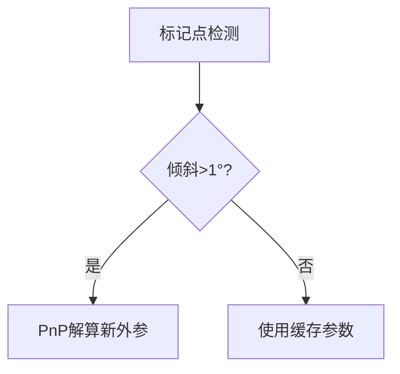

# 视觉坐标测量算法技术说明

## 1. 标定子系统
### 1.1 相机内参标定
- 张正友标定法改进流程
- 畸变模型选择依据（Brown-Conrady模型）
- 标定板精度要求：±0.01mm/m

## 2. 核心算法
### 2.1 反投影法推导
$$ \mathbf{X}_{world} = R^{-1}(s \cdot K^{-1}\mathbf{x}_{pixel} - t) $$
- 尺度因子s的闭式解
- 平面约束的数学证明

### 2.2 动态外参更新

